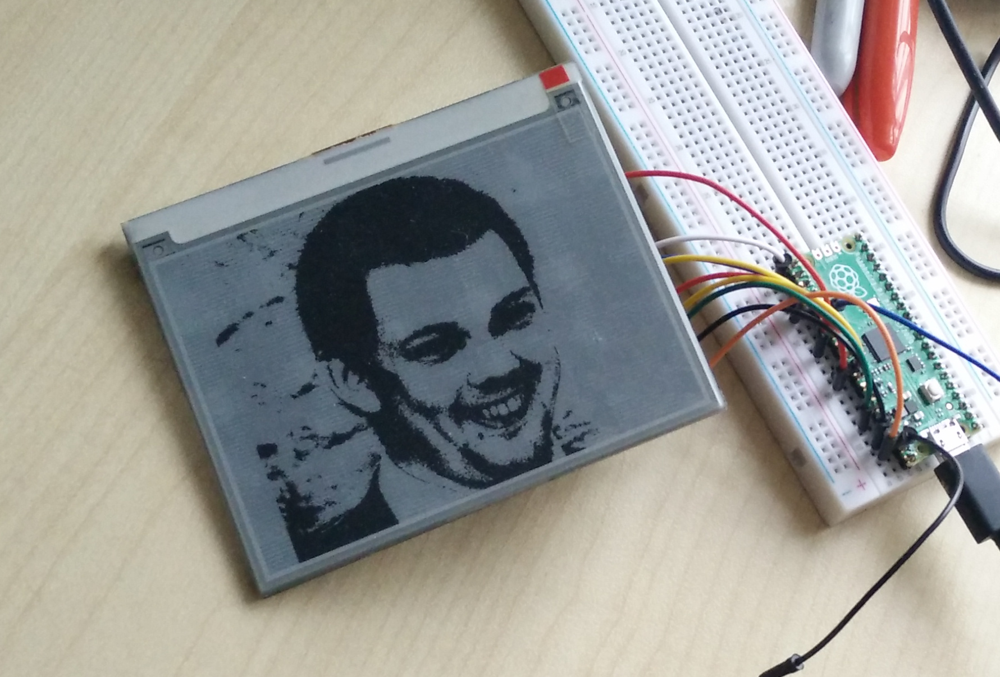

# InkyWHAT eInk screen library for Raspberry Pi Pico

This is not exactly complete, but the basics are there. I stopped working on it because it
became apparent that the eInk screen was not performant enough for my application.

If you want to use this library, you'll need to add a function like `inky_setpixel()` that allows you to write
bits into the `inky_pixbuf` array. You'll probably also want to remove the default image that it
comes up with, which is a black-and-white representation of my face.

Copy and paste `src/inky.c` and `src/inky.h` from this project into your project, edit them
to suit your needs, and consult `CMakeLists.txt` for tips on how to build it.

Consult the Raspberry Pi & Raspberry Pi Pico pinouts to wire the GPIO header on the back of
the inkyWHAT to the corresponding pins on the Pico. You don't need to bother with the I2C
pins as these are only used to access the EEPROM on the inkyWHAT, which this library does not
use.

For more on how to drive the inkyWHAT, consult Pimoroni's Python library: https://github.com/pimoroni/inky/blob/master/library/inky/inky.py

Email james@incoherency.co.uk if you want any help.

